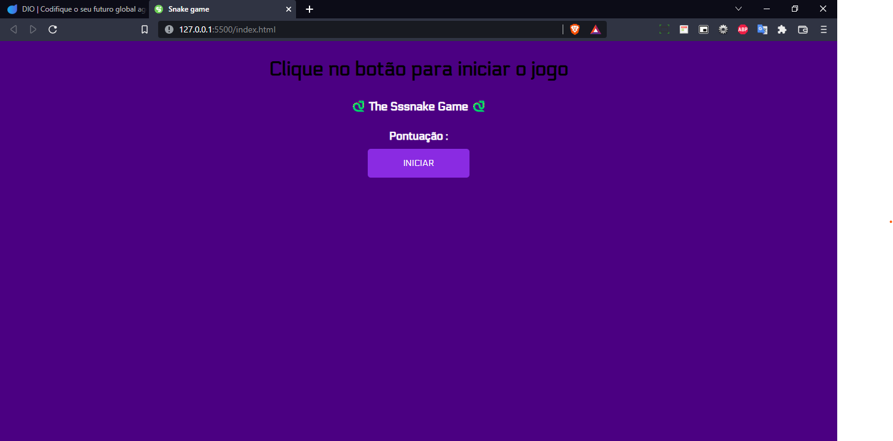
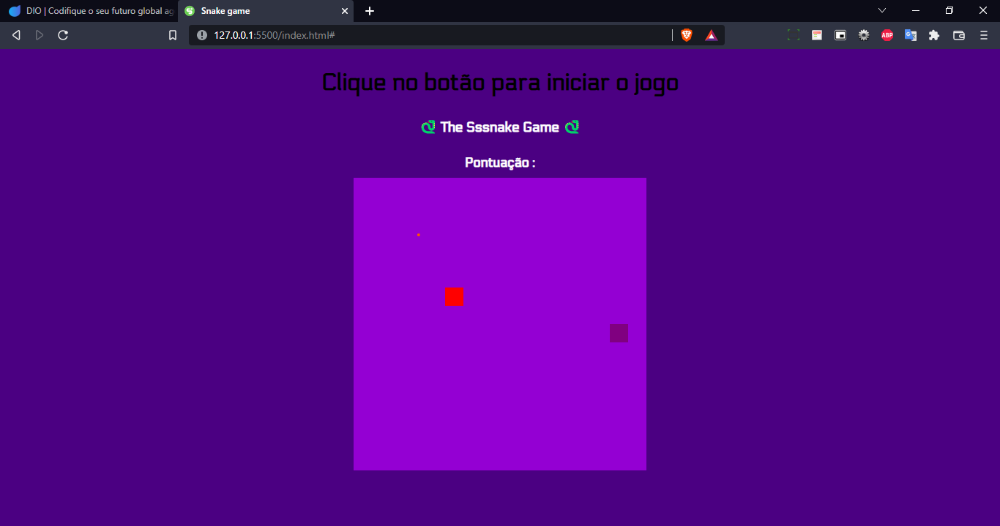
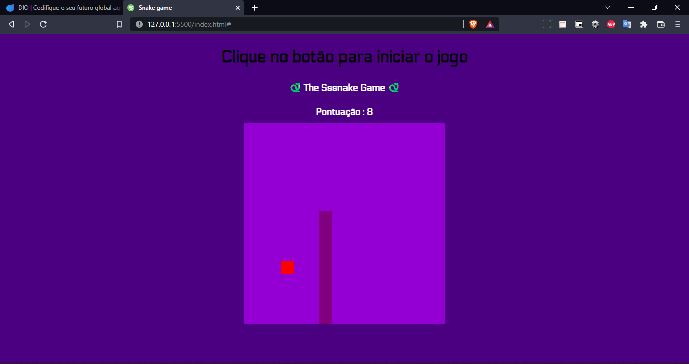
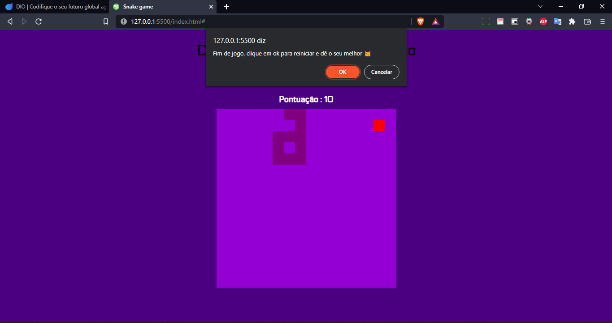

# 🐍 The Sssnake Game 🐍
Projeto orientado pelo bootcamp HTML Web Developer da [DIO](https://web.dio.me/track/html-web-developer)


#### Sobre o projeto 💻 
Baseado no clássico "jogo da cobra" , The Sssnake Game reproduz algumas das funções desse jogo, apenas para fins de estudo. Essa aplicação é o projeto final do bootcamp citado acima, servindo para aplicar os conhecimentos em Front-End

#### Linguagens utilizadas 
- HTML5 🦴
- CSS3 🍃
- JavaScript ⚙️

###  Como jogar 🎮
Utilize as teclas ↑ ↓ → ← , para se mover dentro do box, tomando cuidado para a cobra não cruzar com o próprio corpo.

### Como acessar o projeto 🚀
O projeto será disponibilzado por uma página web, [clicando aqui](https://snake-game-dio-pi.vercel.app/), ou rodando em sua máquina.

#### Como rodo essa aplicação em minha máquina? 🤔
Com o Git em sua máquina , utilize essa sequencia de códigos

```
# Clone o projeto para sua máquina
git clone  https://github.com/micheltechEr/snake-game-dio.git

# Acesse a pasta
cd snake-game-dio
```
Bom jogo!! 👾

### Capturas de tela da aplicação

#### Estágio inicial



#### Inicio do jogo



#### Cobra em bom tamanho depois de consumir o pixel



#### Fim de jogo


